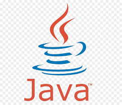

# Technologies used in the project: Java, Spring Boot, Postgre SQL

<table>
  <tr>
    <td align="center" >
      <b>JAVA</b>
    </td>
    <td align="center" style="padding-top: 15px;">
      
    </td>
  </tr>
 <tr>
    <td align="center" >
      <b>POSTGRE SQL</b>
    </td>
    <td align="center" style="padding-top: 15px;">
      
    </td>
  </tr>
 <td align="center" >
      <b>SPRİNT BOOT</b>
    </td>
    <td align="center" style="padding-top: 15px;">
      
    </td>
  </tr>
</table>

# Library System

Library management system project, borrowing books from the library, registering them, etc. This project is designed as an API to be able to do things. Crud operations are defined for each entitiy. 

# When creating this application, the relationships with the uma diagram were determined

<h2>Endpoint</h2>

To check endpoints of the project, you can take a look at the (endpoint.md) file.
